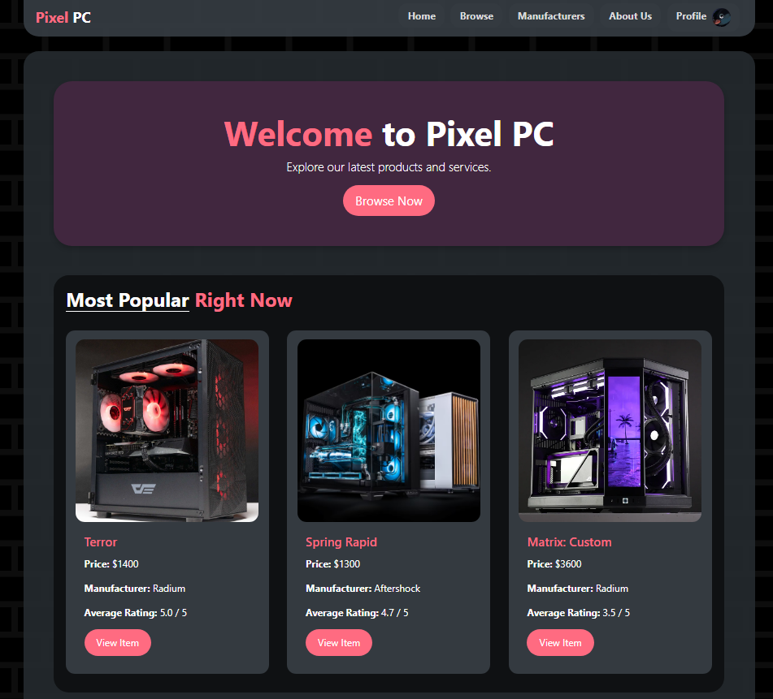
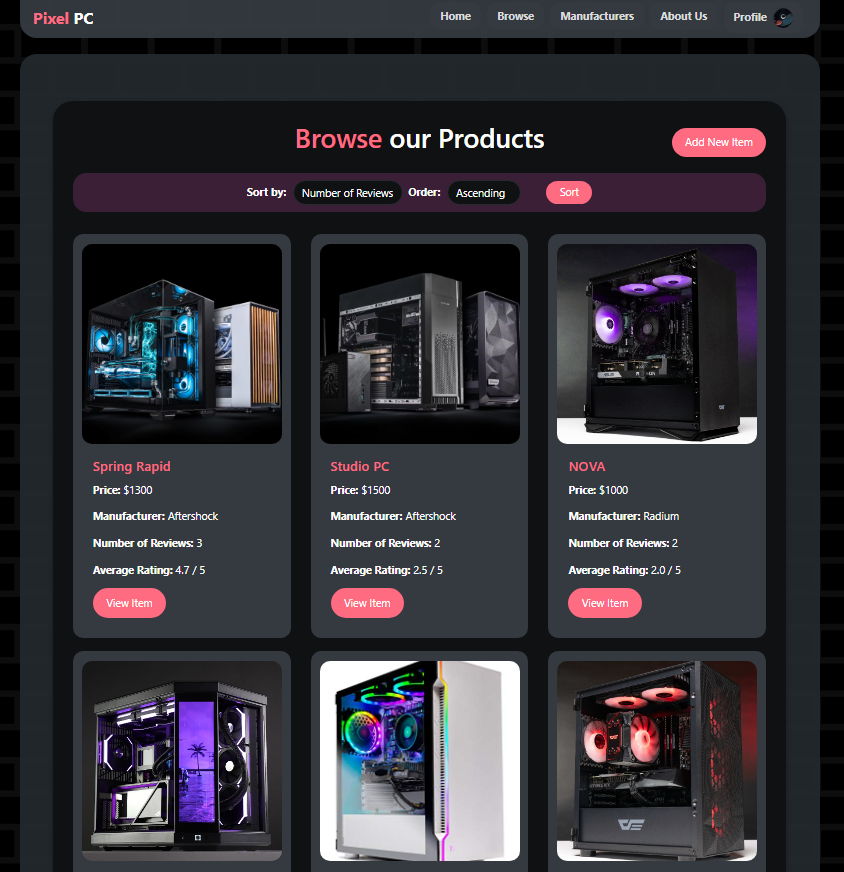
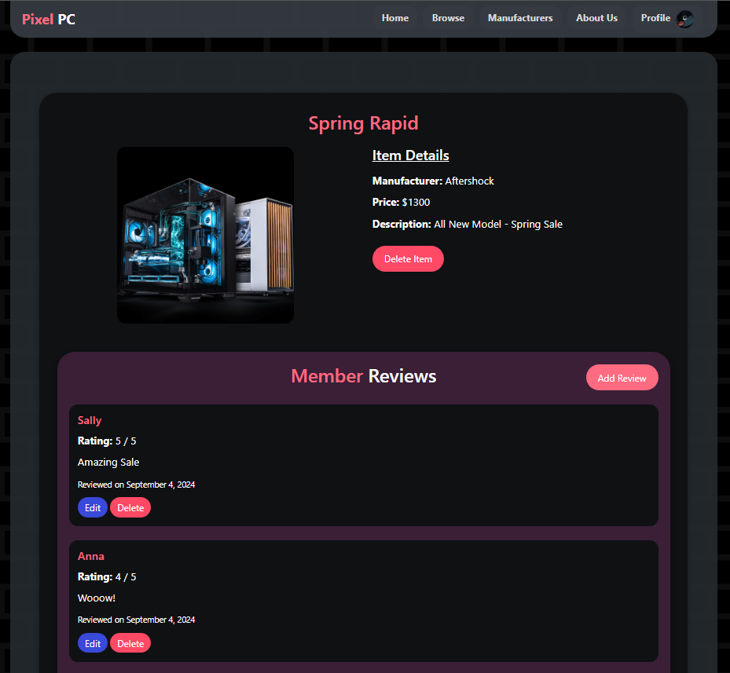

# Review Web Application
## Overview
In this assignment, I built a basic review web application in Laravel, using only Laravel’s routing and views (no controllers, models, or built-in validation). Functions include: store and display user reviews for various items (e.g., smartphones, cars, hotels) - I chose PC's. 

## Project
| Home Screen                                          | Products                                           | Add/Edit/Delete Reviews                                              |
|--------------------------------------------------------|-------------------------------------------------------------|-------------------------------------------------------------|
|  |  |  |

## The project required:

1. **Routing & Templating Only:**

    - Use raw SQL queries (via DB::select(), DB::insert() etc.) to interact with the database—no Eloquent ORM, no migration/seeder classes, and no built-in Laravel validation features.
    - Implement your own server-side validation and sanitization (HTML, SQL).

2. **Core Features:**

    - A home page listing all items and showing the average rating plus number of reviews.
    - Create, read, update, and delete for items and their reviews (including user input checks, forbidden symbols, and date handling).
    - A navigation menu on every page, plus a “sort” feature for items (by number of reviews or average rating).
    - Show manufacturer listings and their average ratings (including a manufacturer’s item listings).
    - Handle user sessions to remember usernames for subsequent reviews.
    - Include a creative way to detect or flag fake reviews.

3. **Implementation & Documentation:**

    - Use an SQL file with initial data.
    - Provide an ER diagram, brief process reflection, and describe any fake review detection strategy.
    - Follow good coding practices (readable naming, consistent indentation, and comment your functions).
    - This setup ensures you practice fundamental web development tasks—database design, raw SQL queries, and custom validation—before exploring Laravel’s more advanced features (controllers, models, migrations, seeders, validation) in [Project 2 - Peer Review App](https://github.com/Shakya-Fernando/web-app-dev-P2)

## Usage Instructions
1. Clone the repository:
   ```bash
   git clone https://github.com/your-github-username/2703ICT-Assignment2.git
   ```
2. Navigate to the project directory (current):
   ```bash
   cd web-app-dev-P1
   ```
3. Install dependencies (Can Skip):
   ```bash
   composer install
   npm install
   ```
4. Set up the database (Can Skip):
   - Configure `.env` file with database credentials.
   - Run migrations and seeders:
     ```bash
     php artisan migrate --seed
     ```
5. Start the server:
   ```bash
   php artisan serve
   ```
6. Access the application at `http://localhost:8000`.